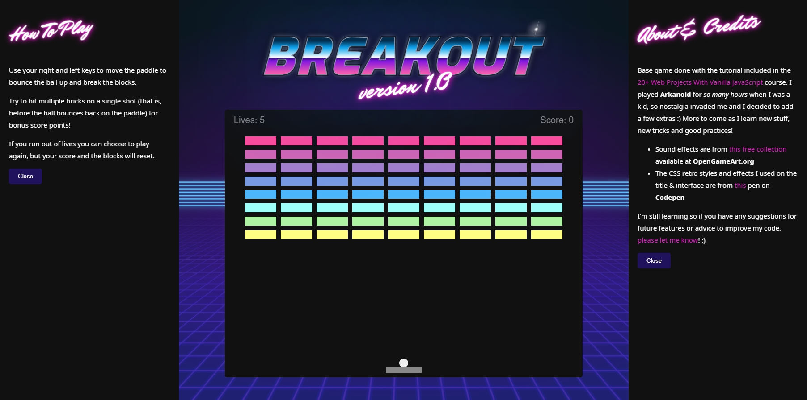

# 🎮 Breakout!

My own take of the Breakout game included as project #17 in the course [**'20 Web Projects With Vanilla JavaScript'**](https://www.udemy.com/course/web-projects-with-vanilla-javascript/) by Brad Traversy on Udemy.

<b><a href="https://marta-vilaseca.github.io/breakout/">&raquo; Play it here! &laquo;</a></b>

## ⭐ Extra features

Extra features included beyond the base tutorial include:

- Ball doesn't start moving automatically when the screen loads, you need to press **Space** or **↑** to start
- Added 'lives' AKA extra balls. Original game kept going when the ball hit the bottom wall, only resetting the bricks.
- Added Winning and Losing screens that display a 'play again' button along with your final score.
- Slightly changed the score system: every brick you break will give you an extra point, BUT if you can break multiple bricks before the ball bounces back on the paddle you'll get bonus points. The more bricks you break before the ball hits the paddle again, the higher the bonus.
- Added an 'Iron Ball' cheat, a special extra powerful ball that will break every brick on its trajectory and will keep moving on a straight line instead of bouncing back (except, of course, when hitting a wall ;)). You can turn it on and off with the **i/I** key. _When this cheat is on use, the bonus score feature is disabled._
- Ball speed will increase gradually the longer you keep bouncing it around, and it will reset back to normal every time you lose a life.
- Added sound efects and improved interface (page layout, game brick colors...)

## 📄 Future feature ideas

- Hall of fame with high scores
- Extra levels
- Maybe other hidden cheats or difficulty settings
- Different color palettes (either chosen by the user or randomly applied)

## 💌 Credits

- Sounds from this sound collection: https://opengameart.org/content/512-sound-effects-8-bit-style
- CSS retro styles from this pen on Codepen: https://codepen.io/ykadosh/pen/zYNxVKr

### If you've read this far

Thank you! I hope you have fun playing :)
